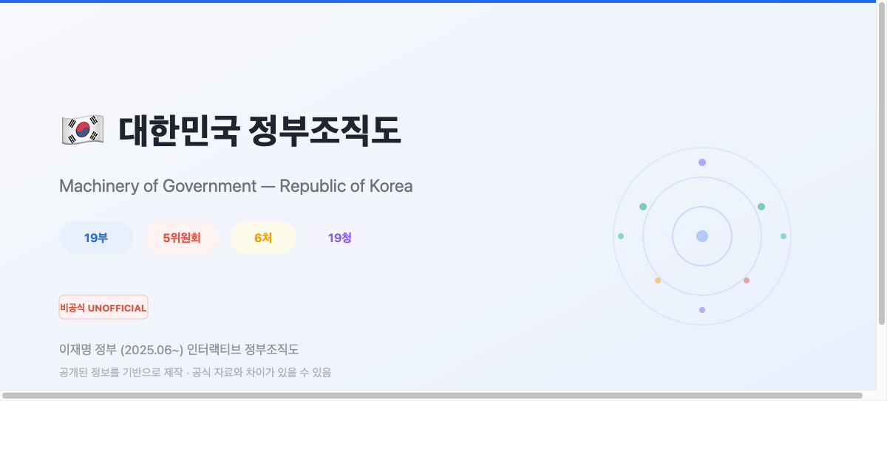

# 대한민국 정부조직도 (비공식)

> **Interactive Machinery of Government — Republic of Korea**

이재명 정부(2025.06~)의 행정부 조직 구조를 인터랙티브하게 시각화한 **비공식** 웹 페이지입니다.

**[Live Demo](https://korea-gov-org.pages.dev)**



## 비공식 자료 안내

이 프로젝트는 공개된 정보를 기반으로 **개인이 제작한 비공식 자료**입니다.
대한민국 정부가 운영하는 공식 사이트가 아니며, 기관 구조/인사/예산 등이 실제와 다를 수 있습니다.
정확한 정보는 [정부24](https://www.gov.kr/portal/orgInfo)를 참고하세요.

## 주요 기능

### 듀얼 뷰

| 레이디얼 | 조직도 |
|----------|--------|
| D3.js radial tree — 대통령 중심 방사형 | 카드 기반 계층형 레이아웃 |
| 줌/패닝, 호버 관계도 하이라이트 | 기관 유형별 색상 코딩 |

### 데이터

- **49개 기관** — 19부, 6처, 18청, 6위원회 (공식 현행 기준)
- **기관장 프로필** — 40명+ 이름·직위·경력·취임일, 17장 Wikipedia 공식 사진
- **예산 시각화** — 2026년 예산안 기준, 노드 크기 비례 + 정렬 모드
- **업무 설명** — 각 기관 소관 업무 1~2문장
- **공식 홈페이지 URL** — 모든 기관 `.go.kr` 링크
- **내부 조직** — 주요 부처 실/국/본부 구조

### 인터랙션

- **호버 관계도** — 마우스 오버 시 대통령까지의 경로 하이라이트 + 리치 툴팁
- **예산 모드** — 토글 ON 시 노드 크기가 예산에 비례, 조직도는 예산순 정렬 + 순위 배지 + 상대 비율 바
- **상세 패널** — 데스크탑: 우측 사이드 패널 / 모바일: 하단 바텀시트 (스와이프 확장)
- **딥링크 & 공유** — URL 해시(`#국방부`)로 특정 기관 바로 열기, 상세 패널에서 공유 버튼으로 URL 복사
- **다크 모드** — 탑바 토글로 라이트/다크 전환, 시스템 테마 자동 감지
- **출처 모달** — 8개 데이터 출처 명시

### 반응형

- **데스크탑** (1024px+): 풀사이즈 레이디얼, 우측 상세 패널
- **태블릿** (768~1024px): 축소 패널
- **모바일** (<768px): auto-fit 줌, 바텀시트 (55vh ↔ 92vh ↔ 닫힘), 터치 제스처

## 기술 스택

- **D3.js v7** — radial tree layout, zoom, circle packing
- **Vanilla HTML/CSS/JS** — 프레임워크 없음, 단일 `index.html` (인라인 데이터)
- **Pretendard** — 폰트 (KRDS 정부 디자인시스템 참고)
- **청와대 컬러 시스템** — [president.go.kr](https://www.president.go.kr) CSS 토큰 기반 라이트/다크 모드
- **Cloudflare Pages** — 호스팅 + Web Analytics

## 파일 구조

```
index.html      # 메인 (CSS + 데이터 + D3 차트 + 뷰 로직 전부 인라인)
data.js         # 데이터 원본 (index.html에도 인라인 복사본 포함)
favicon.svg     # SVG 파비콘
og-image.svg    # OG 이미지 소스 (SVG)
og-image.png    # OG 이미지 (1200x630)
CHANGELOG.md    # v0~v23 변경 이력
CLAUDE.md       # Claude Code 작업 지침
README.md       # 프로젝트 문서
```

## 배포

```bash
# Cloudflare Pages
wrangler pages deploy . --project-name korea-gov-org
```

## 데이터 검증

```bash
node scripts/validate-data.mjs
```

## 데이터 출처

| 출처 | 용도 |
|------|------|
| [정부24](https://www.gov.kr/portal/orgInfo) | 공식 정부 조직 정보 |
| [위키백과: 이재명 정부의 국무위원](https://ko.wikipedia.org/wiki/이재명_정부의_국무위원) | 장관 프로필 사진, 인사 |
| [대한민국 정책브리핑](https://www.korea.kr) | 장관 후보자 지명, 차관급 인사 |
| [나무위키: 이재명 정부/인사](https://namu.wiki/w/이재명%20정부/인사) | 청장·처장·위원장급 인사 |
| 각 부처 공식 홈페이지 | 업무 소개, 조직도 |
| 2026년 정부 예산안·보도자료 | 부처별 예산 규모 및 정책 변화 확인 |
| [KRDS](https://www.krds.go.kr) | UI/UX 디자인 가이드라인 참고 |
| [대한민국 대통령실](https://www.president.go.kr) | 컬러 시스템 (라이트/다크 모드 토큰) |
| [machineryofgovernment.uk](https://machineryofgovernment.uk) | 인터랙션 디자인 참고 |

## 만든 사람

**kimtoma** — [kimtoma.com](https://kimtoma.com) · [LinkedIn](https://www.linkedin.com/in/kimkyungsoo/)

## 라이선스

프로필 사진은 [Wikimedia Commons](https://commons.wikimedia.org/) 공개 라이선스 이미지입니다.
코드는 MIT License로 자유롭게 사용 가능합니다.
